# 🦭 海豹骰日志后端 - Worker版

一个抓包分析 + 询问开发者后自实现的海豹骰日志后端项目。

注意！本项目的编写者是Javascript初学者，建议目前尝鲜使用本项目，以免造成数据丢失！

## 优点

1. 自部署，数据全部由自己（？）掌控
2. 便宜。仅需要一个绑定在Cloudflare的域名即可使用
3. 安全。仅你自己的染色器可以访问（其实就是跨域配置）

## 限制

1. 免费版本的限制如下：

这意味着一天大概最多写入1000个日志。我想这个数量应该足够用了。

2. 需要一个域名，要花钱，不如白嫖来的舒服
3. 需要稍微进行一些简单操作，您可能需要备用一个梯子。当然，若您能直接访问Cloudflare.com，则大概率不需要。

> 如果您几乎是电脑小白，那么下面的教程可能对您有些困难。您或许需要一些技术dalao的帮助。
>
> 如果您本身就是开发者，那下面的东西可能对您没什么难度Orz

## 怎么用

纯 Cloudflare 部署的教程继续往下看，Cloudflare + Vercel 部署的旧教程归档在 [Cloudflare + Vercel 部署](./archived/deploy-with-cf-and-vercel.md)。

### 提前准备：购买域名

首先注册一个cloudflare账号并绑定一个域名。这里以阿里云为例（可以选择腾讯，百度等其他域名，甚至你可以搜索一下tk免费域名，但一定要是能换绑到cloudflare的）：

**如果你有外币支付的能力，建议直接在 cloudflare 购买域名。**

以下以阿里云购买为例：

首先转到https://wanwang.aliyun.com/domain/ 并登录一个账号。然后在上面搜索你想要的域名名称，比如此处以sealdiceisgood为例：
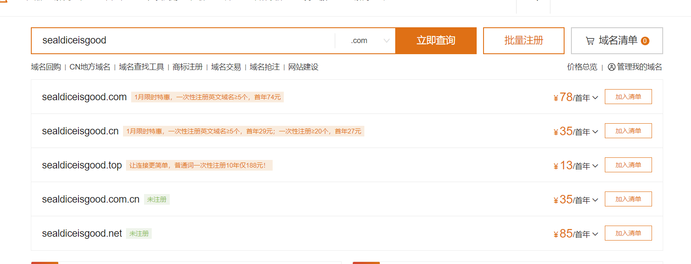

挑选好心仪（便宜）的域名之后直接花钱即可。之后参考：

https://bbs.maozhishi.com/d/56-cloudflare 的方式，将域名换绑到cloudflare。

### 提前准备2：注册Github

准备一把趁手的梯子，首先注册一个Github账号。Github地址：https://github.com/ 善用翻译，或者您可以参考：https://zhuanlan.zhihu.com/p/658727572 。

## 使用 Cloudflare Pages 部署染色器前端

先进入海豹染色器前端源码仓库 https://github.com/sealdice/story-painter 来 fork 对应项目，记下 fork 后你自己仓库的地址。 

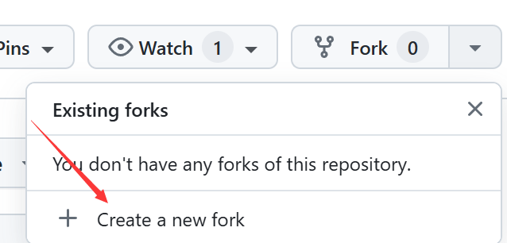

进入 cf pages 页面

选择创建应用

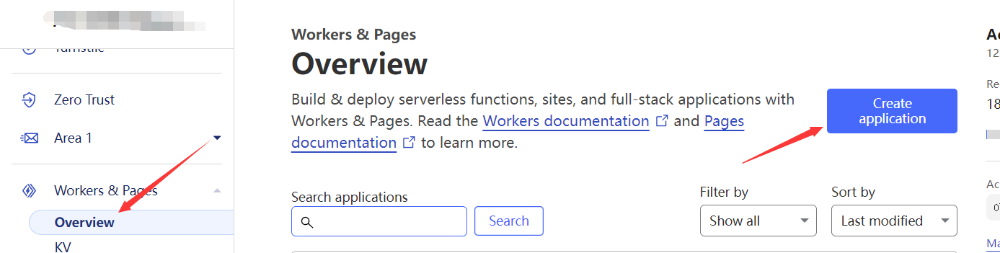

创建 Pages 站点

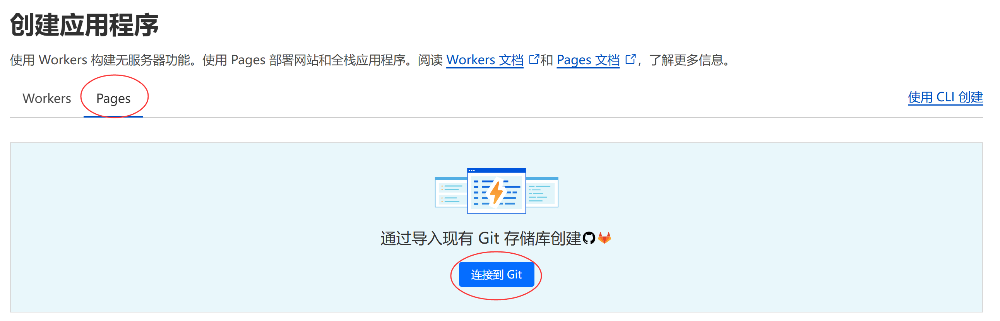

连接到你刚刚 fork 的海豹染色器前端源码仓库，仓库名在你没有修改过的情况下应该是 story-painter。
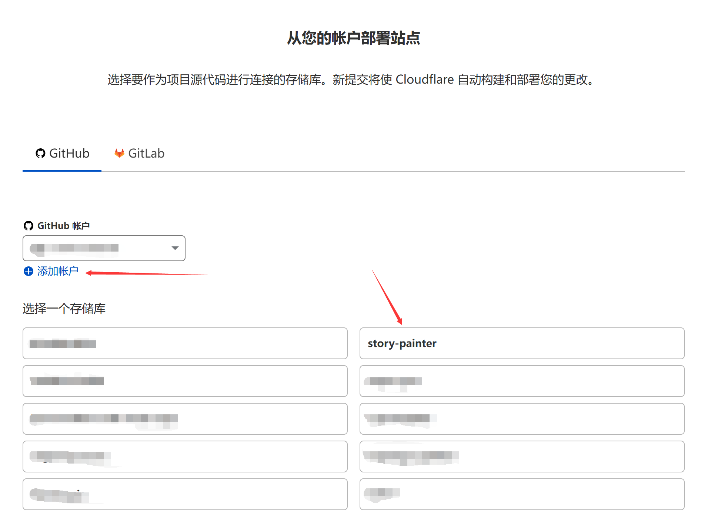

设置对应部署

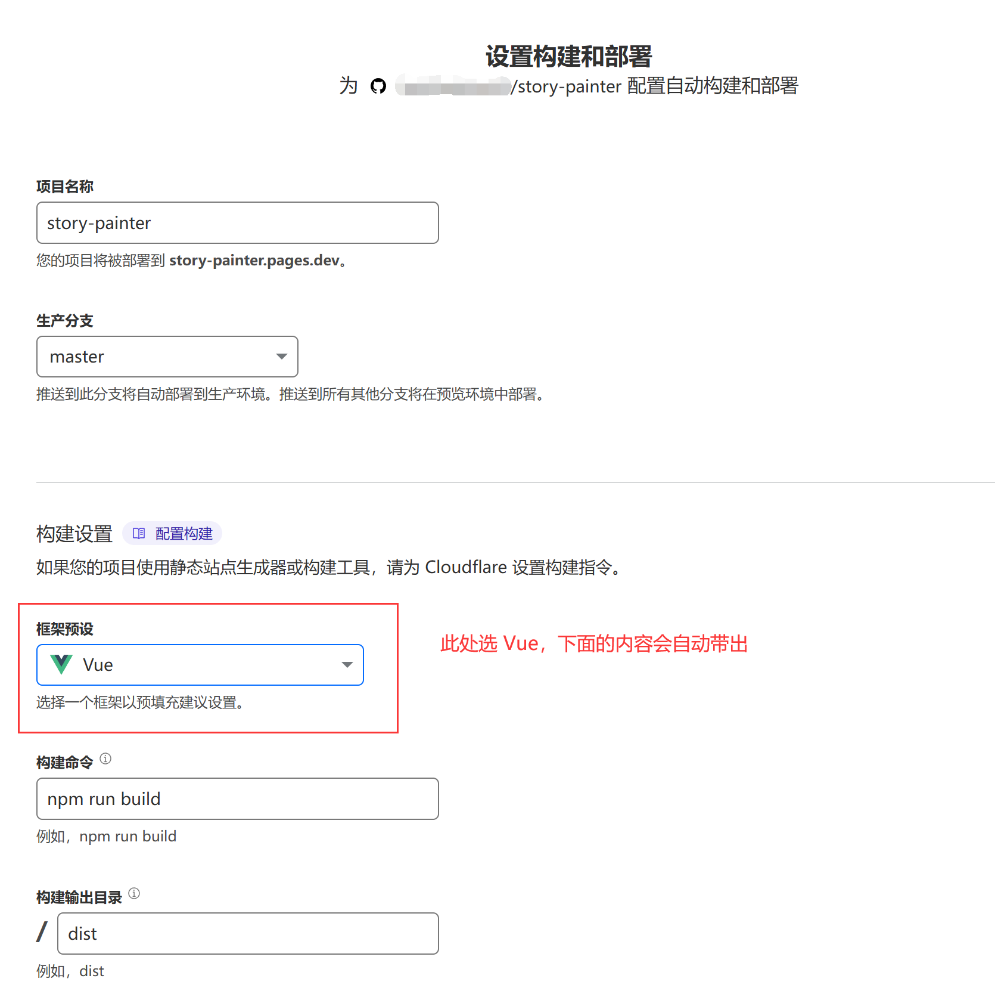

之后点保存和部署，成功后打开部署好的 pages 站点，设置自定义域

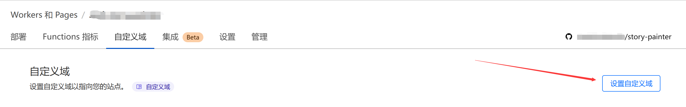

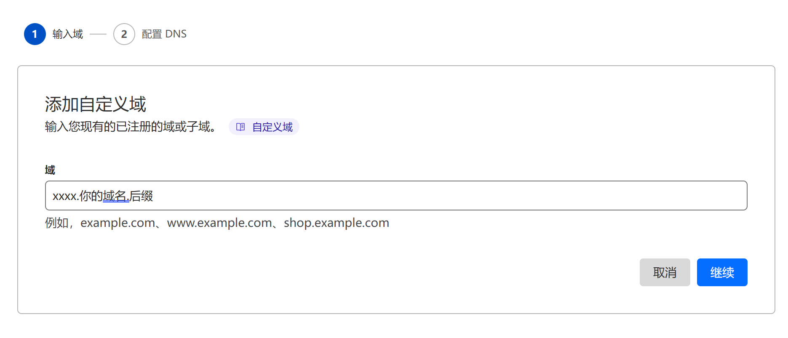

如图，xxxx是你自己起的，注意记住，这里以myseal.example.com为例。设置好之后点继续。

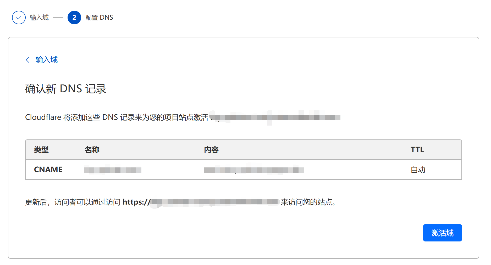

点击激活域

## 使用 Cloudflare Worker 部署染色器后端

到Cloudflare处，并点击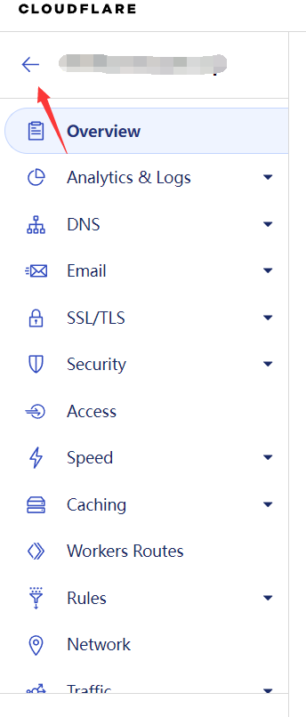

以返回。

找到：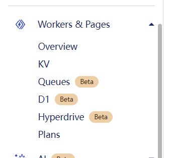

然后点击KV。在此处点击“Create Namespaces"

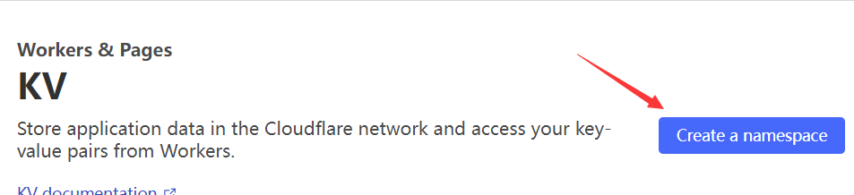

随便起个名（请记住这个名字下面要用），然后点击add：

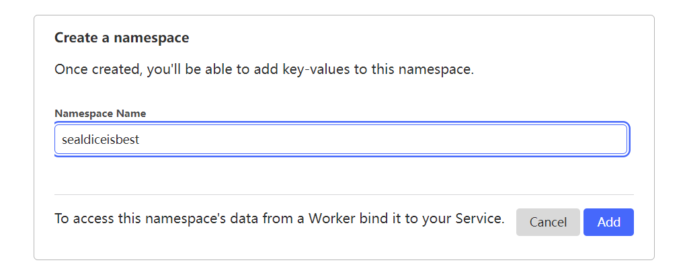

完成后，点击OverView，并点击Create Application:

之后点击Create Worker:

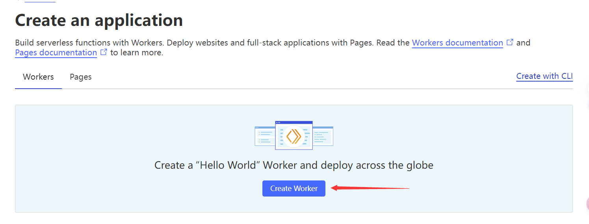

然后点击Deploy:

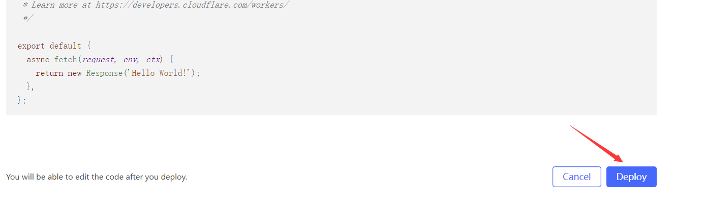

再点击Edit Code:

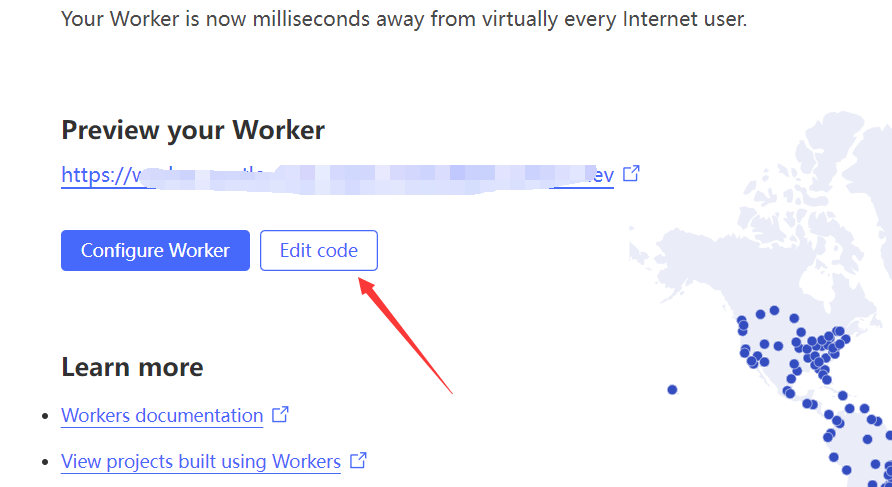

将本项目的src/worker.js里的内容复制粘贴到新出现的左侧页面里：

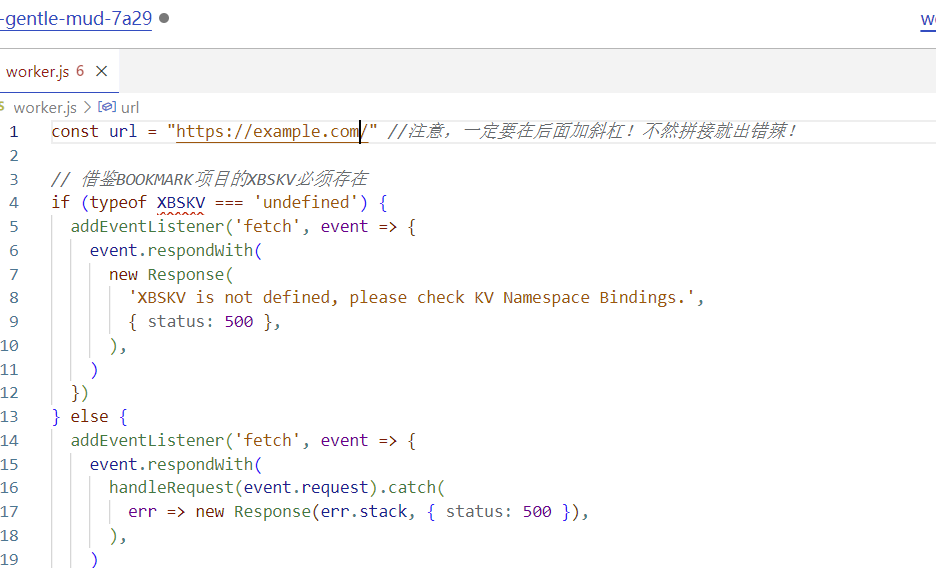

并将上一个步骤最后的地址，替换url的地址（注意那个斜杠别多了或者少了，以及不要复制两个https……）

比如我们这里的结果是这样的：

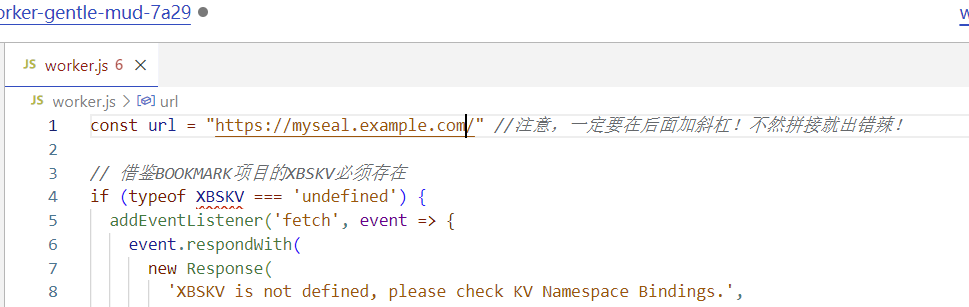

之后点击右上角的Save And Deploy。之后从左上角

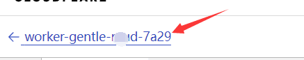

这里返回。

接下来转到界面中的Triggers位置：

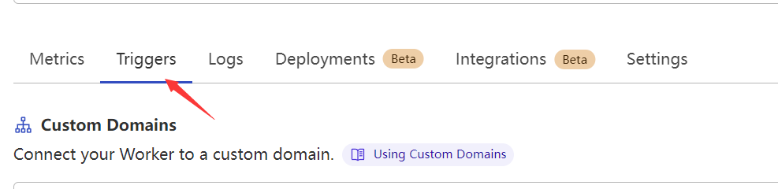

在此处点击：Add Custom Domain

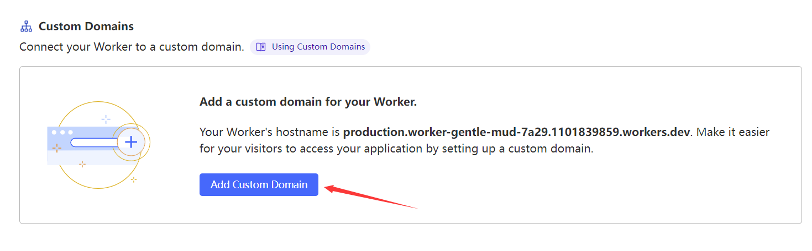

在新出现的页面里，输入xxxxxxxxx.你的域名.你的后缀，xxxxxxxxx同样是自己随便起。

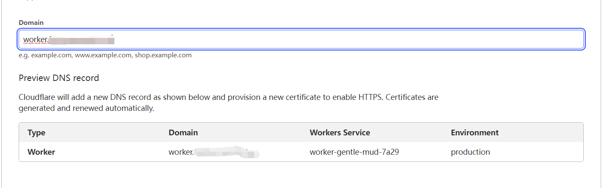

比如我们这里以这个地址为例(worker.example.com)

完成后点击Add Custom Domain，然后转到Settings：

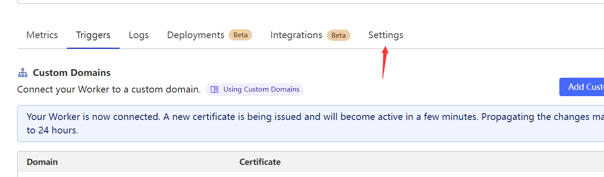

左侧点击Varibles:

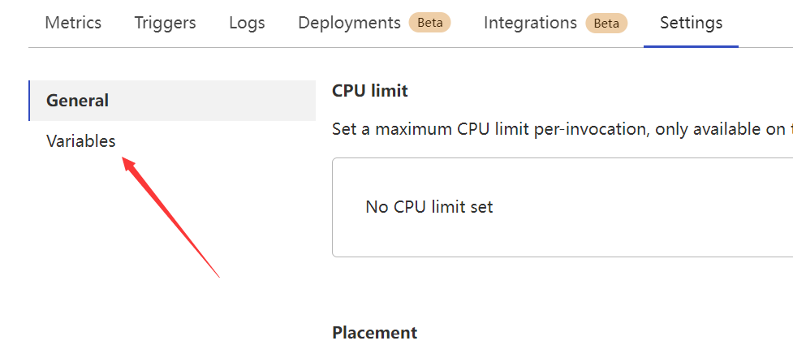

在右侧找到：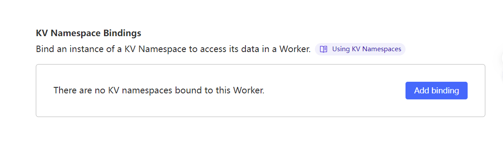

如图操作，之后点击Save and deploy：

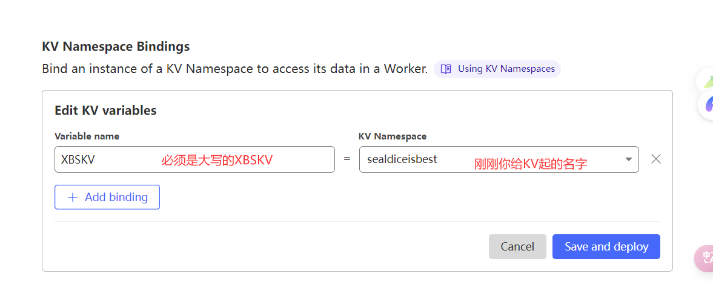

接下来您可以访问xxxxxxxxx.你的域名.你的后缀(本例是worker.example.com)，如果没有问题，你将会看到一句话：

## 修改

打开你自己的GitHub，进入你 fork 的海豹染色器前端仓库：（下面的示例中修改了库名）

点击这个项目进去，依次点击src/store.ts，之后点击那个笔的按钮进行修改:

将：

修改为：

(也就是上一大步最后你自己起的地址）

然后点击：两次，保存修改。

之后在 cloudflare pages 里可以看到正在重新Build，等待构建成功

## 设置海豹

使用最新版本的海豹，进入 weiui 页面，点击左上角的 SealDice 8 次打开高级设置页

填入你的后端地址 + /dice/api/log，如示例后端地址为 worker.example.com，那么填入 `http://worker.example.com/dice/api/log` 即可

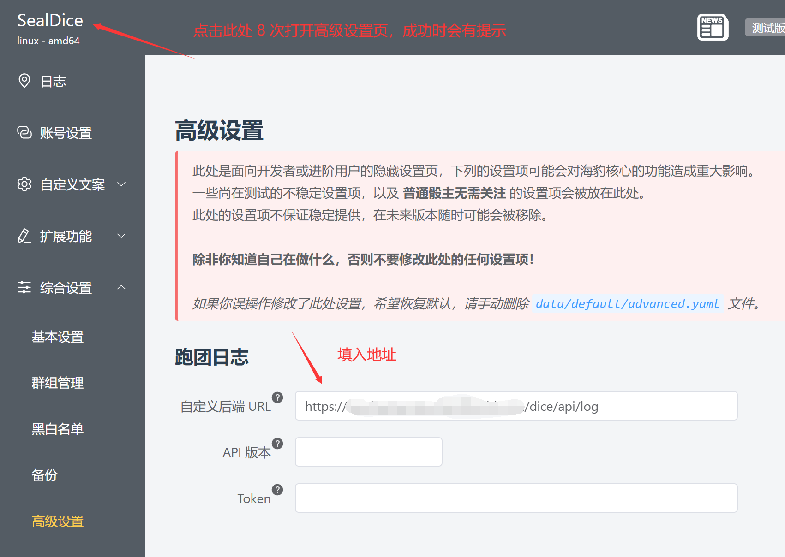

## 总结

总共要设置两个地址，一个是染色器地址，一个是后端地址。
